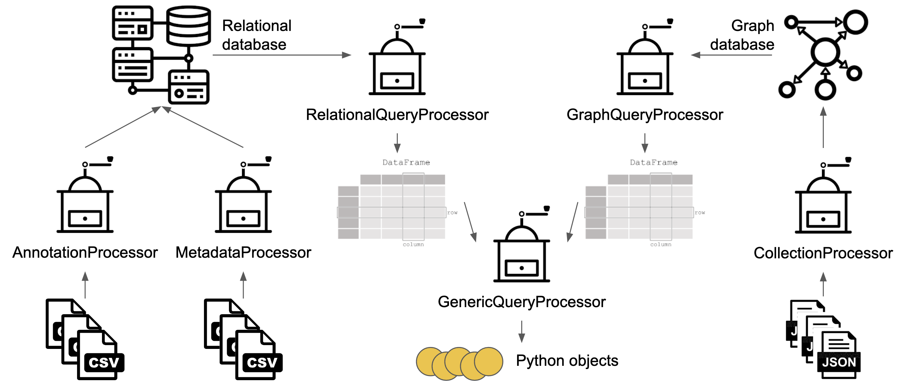
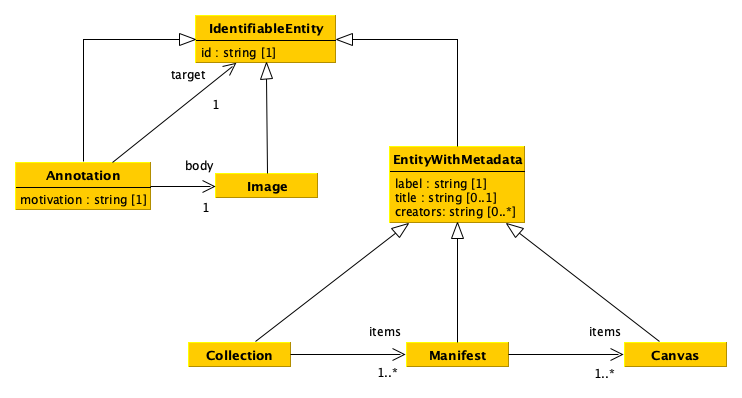
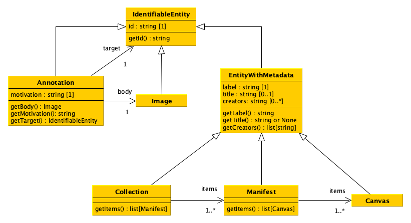
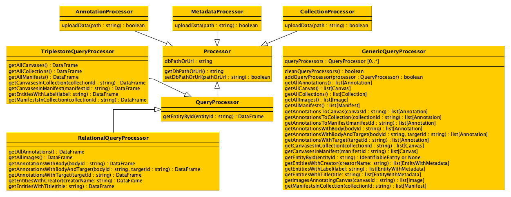

# Data Science: project

The goal of the project is to develop a software that enables one to process data stored in different formats and to upload them into two distinct databases to query these databases simultaneously according to predefined operations. 

## Data

* there are CSV files with [annotations](data/annotations.csv) and [metadata](data/metadata.csv), containing annotations describing images and including metadata of IIIF objects, i.e. collections, manifests and canvases.

* there are two files, [a JSON file](data/collection-1.json) containing the IIIF collection "Works of Dante Alighieri" and [another JSON file](data/collection-2.json) containing the IIIF collection "Fondo Giuseppe Raimondi". Each collection contains information of the other IIIF entities (i.e. manifests and canvases): their identifiers, types, labels, and containement relations.

## Workflow

## Data model

## UML of data model classes

## UML of additional classes

### Class `Processor`

#### Attributes
`dbPathOrUrl`: the variable containing the path or the URL of the database, initially set as an empty string, that will be updated with the method `setDbPathOrUrl`.

#### Methods
`getDbPathOrUrl`: it returns the path or URL of the database.

`setDbPathOrUrl`: it enables to set a new path or URL for the database to handle.

### Class `AnnotationProcessor`

#### Methods
`uploadData`: it takes in input the path of a CSV file containing annotations and uploads them in the database. This method can be called everytime there is a need to upload annotations in the database.

### Class `MetadataProcessor`

#### Methods
`uploadData`: it takes in input the path of a CSV file containing metadata and uploads them in the database. This method can be called everytime there is a need to upload annotations in the database.

### Class `CollectionProcessor`

#### Methods
`uploadData`: it takes in input the path of a JSON file containing collections (with manifests and canvases) and uploads them in the database. This method can be called everytime there is a need to upload collections in the database.

### Class `QueryProcessor`

#### Methods
`getEntityById`: it returns a data frame with all the entities matching the input identifier (i.e. maximum one entity).

### Class `RelationalQueryProcessor`

#### Methods
`getAllAnnotations`: it returns a data frame containing all the annotations included in the database.

`getAllImages`: it returns a data frame containing all the images included in the database.

`getAnnotationsWithBody`: it returns a data frame containing all the annotations included in the database that have, as annotation body, the entity specified by the input identifier.

`getAnnotationsWithBodyAndTarget`: it returns a data frame containing all the annotations included in the database that have, as annotation body and annotation target, the entities specified by the input identifiers.

`getAnnotationsWithTarget`: it returns a data frame containing all the annotations included in the database that have, as annotation target, the entity specified by the input identifier.

`getEntitiesWithCreator`: it returns a data frame containing all the metadata included in the database related to the entities having the input creator as one of their creators.

`getEntitiesWithTitle`: it returns a data frame containing all the metadata included in the database related to the entities having, as title, the input title.

### Class `TriplestoreQueryProcessor`

#### Methods
`getAllCanvases`: it returns a data frame containing all the canvases included in the database.

`getAllCollections`: it returns a data frame containing all the collections included in the database.

`getAllManifests`: it returns a data frame containing all the manifests included in the database.

`getCanvasesInCollection`: it returns a data frame containing all the canvases included in the database that are contained in the collection identified by the input identifier.

`getCanvasesInManifest`: it returns a data frame containing all the canvases included in the database that are contained in the manifest identified by the input identifier.

`getEntitiesWithLabel`: it returns a data frame containing all the metadata included in the database related to the entities having, as label, the input label.

`getManifestsInCollection`: it returns a data frame containing all the manifests included in the database that are contained in the collection identified by the input identifier.

### Class `GenericQueryProcessor`

#### Attributes
`queryProcessors`: the variable containing the list of `QueryProcessor` objects to involve when one of the *get* methods below is executed. In practice, every time a *get* method is executed, the method will call the related method on all the `QueryProcessor` objects included in the variable `queryProcessors`, before combining the results and returning the requested object.

#### Methods
`cleanQueryProcessors`: It clean the list `queryProcessors` from all the `QueryProcessor` objects it includes.

`addQueryProcessor`: It append the input `QueryProcessor` object to the list `queryProcessors`.

`getAllAnnotations`: it returns a list of objects having class `Annotation` included in the databases accessible via the query processors.

`getAllCanvas`: it returns a list of objects having class `Canvas` included in the databases accessible via the query processors.

`getAllCollections`: it returns a list of objects having class `Collection` included in the databases accessible via the query processors.

`getAllImages`: it returns a list of objects having class `Image` included in the databases accessible via the query processors.

`getAllManifests`: it returns a list of objects having class `Manifest` included in the databases accessible via the query processors.

`getAnnotationsToCanvas`: it returns a list of objects having class `Annotation`, included in the databases accessible via the query processors, that have, as annotation target, the canvas specified by the input identifier.

`getAnnotationsToCollection`: it returns a list of objects having class `Annotation`, included in the databases accessible via the query processors, that have, as annotation target, the collection specified by the input identifier.

`getAnnotationsToManifest`: it returns a list of objects having class `Annotation`, included in the databases accessible via the query processors, that have, as annotation target, the manifest specified by the input identifier.

`getAnnotationsWithBody`: it returns a list of objects having class `Annotation`, included in the databases accessible via the query processors, that have, as annotation body, the entity specified by the input identifier.

`getAnnotationsWithBodyAndTarget`: it returns a list of objects having class `Annotation`, included in the databases accessible via the query processors, that have, as annotation body and annotation target, the entities specified by the input identifiers.

`getAnnotationsWithTarget`: it returns a list of objects having class `Annotation`, included in the databases accessible via the query processors, that have, as annotation target, the entity specified by the input identifier.

`getCanvasesInCollection`: it returns a list of objects having class `Canvas`, included in the databases accessible via the query processors, that are contained in the collection identified by the input identifier.

`getCanvasesInManifest`: it returns a list of objects having class `Canvas`, included in the databases accessible via the query processors, that are contained in the manifest identified by the input identifier.

`getEntityById`: it returns an object having class `IdentifiableEntity` identifying the entity available in the databases accessible via the query processors matching the input identifier (i.e. maximum one entity). In case no entity is identified by the input identifier, `None` must be returned.

`getEntitiesWithCreator`: it returns a list of objects having class `EntityWithMetadata`, included in the databases accessible via the query processors, related to the entities having the input creator as one of their creators.

`getEntitiesWithLabel`: it returns a list of objects having class `EntityWithMetadata`, included in the databases accessible via the query processors, related to the entities having, as label, the input label.

`getEntitiesWithTitle`: it returns a list of objects having class `EntityWithMetadata`, included in the databases accessible via the query processors, related to the entities having, as title, the input title.

`getImagesAnnotatingCanvas`: it returns a list of objects having class `Image`, included in the databases accessible via the query processors, that are body of the annotations targetting the canvaes specified by the input identifier.

`getManifestsInCollection`: it returns a list of objects having class `Manifest`, included in the databases accessible via the query processors, that are contained in the collection identified by the input identifier.
